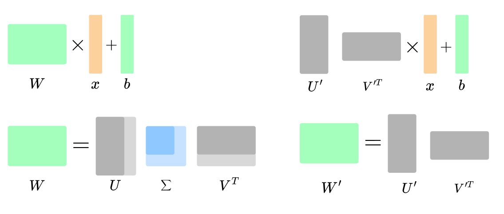

# ysda_transformer_svd_compression
A project on the topic of compression of pretrained models done by Daniil Maslov, Arsenii Rybakov and Ruben Safaryan.

Here we compare several zero-learning and finetune-based transformer compression approaches.

